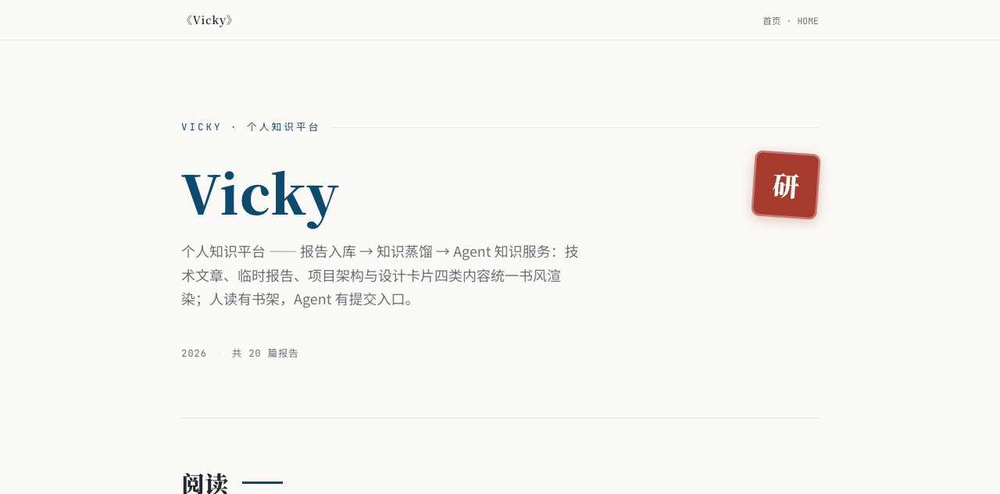
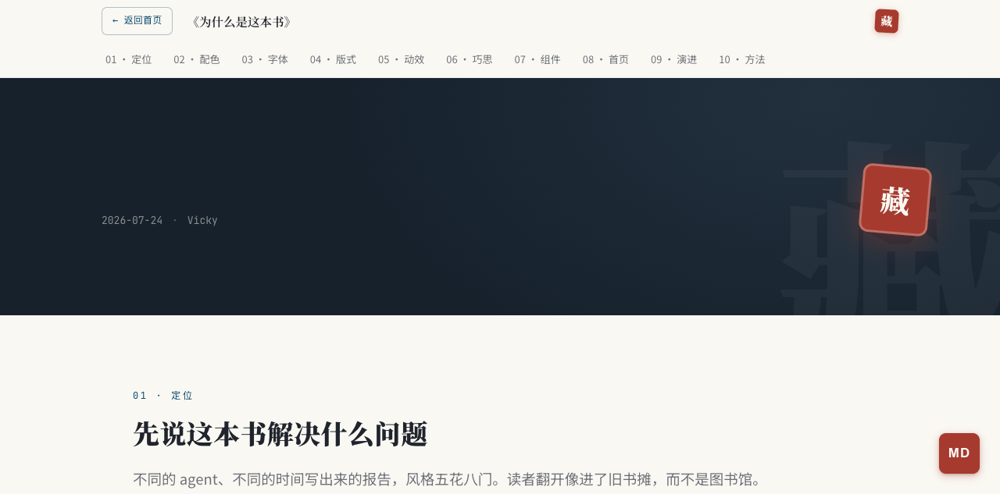
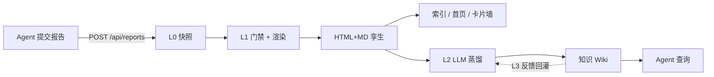

# Vicky — 把 AI 报告变成一本书

> 任何 Agent 调研完一个技术，POST 过来 → 门禁校验 → 统一「书」风格渲染 → LLM 蒸馏成知识 Wiki → 供后续 Agent 查询。

<div align="center">

**让 AI 报告不再吃灰：从「单篇文档」到「可持续查询的知识库」**

[](LICENSE)
[](#快速开始)
[](#开发)
[](#快速开始)


</div>

## 演示（30 秒看懂 Vicky 在干什么）



> 📌 GIF 占位：后续会放「报告提交 → 门禁校验 → 书风格渲染 → 知识蒸馏」的 15 秒演示录屏。如果你有录屏工具，欢迎帮忙贡献 demo！

## 它解决什么问题

不同 agent、不同时间写的报告，风格五花八门——读者翻开像进了旧书摊，而不是图书馆。更糟的是：研究结论散落在单篇报告里，**后续 Agent 无法直接复用**。

Vicky 的解法：**视觉 taste 由 server 端模板强制**（agent 碰不到 CSS），**内容 taste 分三层约束**（表述形态由门禁拒收兜底、语义词汇由写作规范约束、框内的画完全放开），最后经 L0–L3 四层蒸馏，把零散报告长成可持续查询的知识服务。

> 「只写了方案和技术，没写技术的原因和解决的场景，理解不了这套技术的优势。」— GameKB 方案汇报 · 领导反馈 · 2026-07
>
> 这条反馈是全书方法论的起点：**先讲为什么，再讲是什么**。见 [`PHILOSOPHY.md`](PHILOSOPHY.md)（《为什么是这本书》）。



## 核心特性

| 特性 | 说明 |
|------|------|
| **四层数据管线** | L0 不可变快照 → L1 门禁+模板渲染 → L2 LLM 知识蒸馏 → L3 使用反馈回灌，每层产物可独立再生 |
| **门禁校验** | 裸 `<table>` / 无结论对比表 / 弃用类名直接 400 拒收；图缺图题图注、AI 腔词、mermaid 未装裱则警告提醒 |
| **书风格设计系统** | 宋体标题 + 书眉 + 藏书章 + 书签丝带；纸 `#FBFAF7` / 墨 `#23272E` / 靛蓝 / 朱砂，模板拥有结构不拥有视觉 |
| **HTML + MD 孪生** | 每篇报告自动生成 .md 孪生（体积约 1/4），AI 消费链接省 ~70% token |
| **注册制模板** | `templates/{name}/` 即插即用（book 深度长读 / brief 结论简报 / arch 架构丛书 / card 卡片墙），mermaid、arch-flow 按需注入 |
| **知识蒸馏** | L2 把 .md 报告 + 已采纳反馈编译成 `knowledge/tech/{topic}/overview.md`，Agent 可查 |
| **反馈回灌** | L3 使用账本 + 仲裁（AI 初裁 / 人工裁决），采纳的反馈与报告平级进 L2 编译 |
| **domain 分区** | tech 进知识库蒸馏、design 聚合成卡片墙、arch 成多页架构站、ephemeral 临时展示 |
| **零依赖** | 纯 Python 标准库 + sqlite3，无框架无外部服务，`python3 -m vicky.web` 即起 |

## 架构

```
Agent 写 HTML 内容 → POST /api/reports → L0 不可变快照存档（data/l0/）
                                            ↓
                                   L1 门禁 → 模板渲染 → public/reports/（HTML + MD 孪生）
                                            ↓
                                   L2 蒸馏 → knowledge/ Wiki（LLM 编译）
                                            ↓
                                   L3 反馈回灌 → 使用账本 + 仲裁 → 采纳进 L2
```



依赖方向严格单向：`web → l3 → l2 → l1 → l0 → store`。

## 快速开始

> 要求：**Python 3.12+**（代码使用了 f-string 嵌套引号语法，3.11 及以下无法运行）。

```bash
git clone https://github.com/fatherplus/vicky.git
cd vicky
python3 -m vicky.web        # 默认 127.0.0.1:9091，无任何依赖
# 打开 http://localhost:9091
```

生成一篇报告：

```bash
curl -X POST http://localhost:9091/api/reports \
  -H 'Content-Type: application/json' \
  -d '{"title": "我的第一篇报告", "slug": "my-first-report", "tag": "tech",
       "content": "<section class=\"opener\"><h2>定位</h2>...</section>"}'
```

报告经 L0 快照 → L1 门禁 → 模板渲染 → HTML+MD 孪生发布，索引页与首页自动重建。先读 `GET /api/guide` 写作规范、用 `POST /api/validate` 预检，避免 400 拒收。

## API

```
POST /api/reports     创建/修订报告（同 slug upsert；series+order 组成丛书卷）
POST /api/validate    预检（violations/warnings/components，不落盘）
POST /api/templates   注册模板（provisional；门禁：占位符/token/契约）
POST /api/knowledge/feedback            L3 反馈（evidence 必填）
POST /api/knowledge/feedback/{id}/judge 人工裁决（adopt/reject）
GET  /api/reports     列出所有报告
GET  /api/knowledge   知识库（?domain=&topic= 单页，不带参列全部）
GET  /api/guide       写作指南（markdown）
GET  /api/templates   模板目录
GET  /api/principles  叙事宪法（markdown）
```

## 目录结构

```
vicky/                核心包（web 路由 / L0-L3 四层管线 / sqlite store）
templates/            注册制报告模板（book / brief / arch / card）
views/                平台整页模板（首页 / 索引 / 知识库 / 卡片墙）
skill/                写作规范（AGENT-GUIDE / BOOK-STYLE / EXPRESSION-GRAMMAR / NARRATIVE-PRINCIPLES）
public/assets/        设计系统（book-style.css 唯一 CSS 来源 + 按需组件）
scripts/              部署与工具（deploy.sh / backfill_md.py）
tests/                122 个 stdlib unittest
```

## 开发与测试

```bash
# 跑全部测试（122 个，纯 stdlib unittest，无需安装）
python3 -m unittest discover -s tests -t .

# 启动开发服务
python3 -m vicky.web
```

开发约定见 [`AGENTS.md`](AGENTS.md)（分层架构、门禁清单、部署）。

## 一起开发？先看看这里

> **为什么值得参与**
> - **MIT License**，代码永远是你的简历
> - **122 个测试兜底**，随便改，改坏了测试会告诉你
> - **模块边界清晰**：L0-L3 严格单向依赖，新人从任意一层切入都不会踩到别的层
> - **痛点真实**：这不是玩具，是本人在生产环境用了半年的工具

**值得打磨的方向**（欢迎 Issue / PR）：

- **报告模板**：新的表述形态 / 组件，需过「跨 ≥3 篇重复出现 + 稳定 HTML 契约」准入
- **门禁与提醒规则**：`vicky/l1_publish.py` 的校验逻辑，防 AI 腔词、保对比有结论
- **蒸馏质量**：L2 编译提示词、L3 仲裁策略、知识 Wiki 结构
- **文档**：README、写作指南、设计规范的中英双语
- **Demo 录屏**：30 秒「报告进 → 书出来」演示 GIF（README 顶部已留位置）

**想一起搞？** 直接开 Issue 说「我想参与 XX」，或者发 PR；也可以 watch 本仓库第一时间收到讨论。

## Topics 建议（GitHub 仓库设置里加）

```
ai-agents, knowledge-base, report-generation, llm, rag, python,
agent-tooling, ai-report, mcp, documentation
```

## License

MIT License. See [LICENSE](LICENSE).
